# Selfie Sample App
# Information

This module contains an interactive [MATLAB® App](https://www.mathworks.com/help/matlab/app-designer.html) that allows you to turn a photo of yourself into a musical sample.

## Background

This app was developed to allow you to use MATLAB® Online to transform selfies into original auditory explorations.

MathWorks sponsors the [MIRROR (Movement to Invest in Reciprocity & Re\-imagine Outreach Relationships](https://www.olin.edu/MIRROR)), a STEM impact studio by Olin College in Cambridge, MA. Led by Dr. Amon Millner, MIRROR seeks to redefine outreach partnerships with industry, academia, and communities. Recognized by the [Biden\-Harris Administration](https://www.whitehouse.gov/ostp/news-updates/2022/12/12/fact-sheet-biden-harris-administration-announces-bold-multi-sector-actions-to-eliminate-systemic-barriers-in-stemm/), MIRROR aims to remove systemic barriers in STEM.

A highlight of MIRROR is the STEM Story Slam, where diverse STEM participants share experiences through creative expressions.

In two events, Dre shared his engineering journey and collaborated with Dr. Millner at MathWorks. They used MATLAB to create a custom beat, inspired by virtual theremin code, which changes sound and background color with mouse movements. Dre chose a colorful image of himself, creating sounds based on pixel colors. He then layered these sounds using BandLab® to produce a unique track. See the full [Selfie Sample story](https://github.com/olincollege/selfie-sample). 

By definition, a musical "sample" is a small segment of audio from a recording that is reused in a new piece of music.

With this app, using a photo of yourself (*selfie*) and orchestral sound samples (*sample*), you will create a brand new **Selfie Sample**!

## Contact Us

Contact the [MathWorks STEM Outreach team](mailto:stemoutreach@groups.mathworks.com) if you would like to provide feedback, or if you have a question.

## Getting Started
### Accessing the Module
### **On MATLAB Online:**

Use the  link to download the module. You will be prompted to log in or create a MathWorks account. The project will be loaded, you will see the app, and the audio files will begin to download. You may have to wait ~5 minutes for the files to download from the online repository.

### **On Desktop:**

Download or clone this repository. Open MATLAB, navigate to the folder containing these scripts and double\-click on [Selfiesample.prj](matlab: openProject("Selfiesample.prj")). It will add the appropriate files to your MATLAB path and open the app. You may have to wait ~2 minutes for the audio files to download from the online repository.

# How to use the app
### Acquire a Selfie
-  If you have a webcam, the preview window should already show you, you! You can click the "Take a Selfie" button to capture a photo of yourself. If you don't like the selfie, feel free to take another using the same button again. 

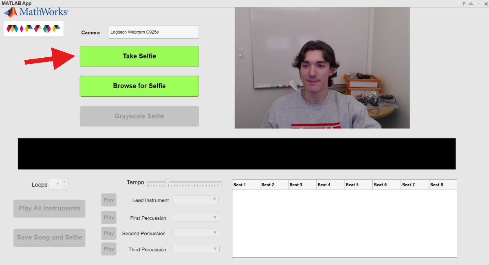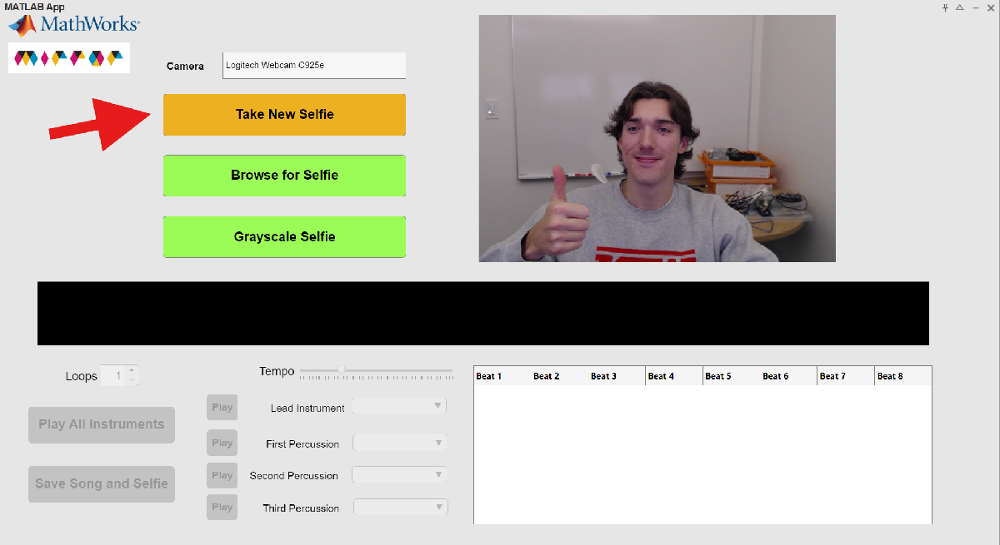

-  If you don't have a webcam, or it cannot be found, you can browse for a selfie on your MATLAB Drive using the "Browse for Selfie" button. Find out more about uploading photos to MATLAB Drive [here](https://www.mathworks.com/help/matlab/matlab_env/access-files-in-matlab-online.html).  

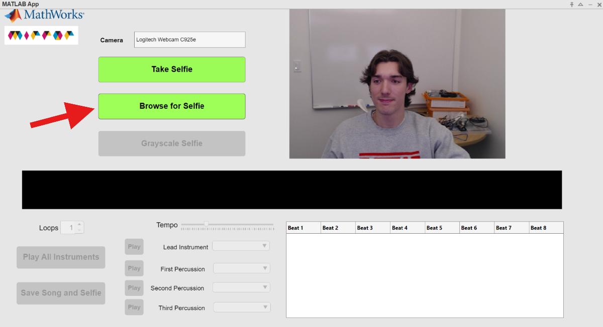

### Grayscale this Selfie and Select your Pixels
-  Once you have a selfie that you are satisfied with, click the "Grayscale Selfie" button. 

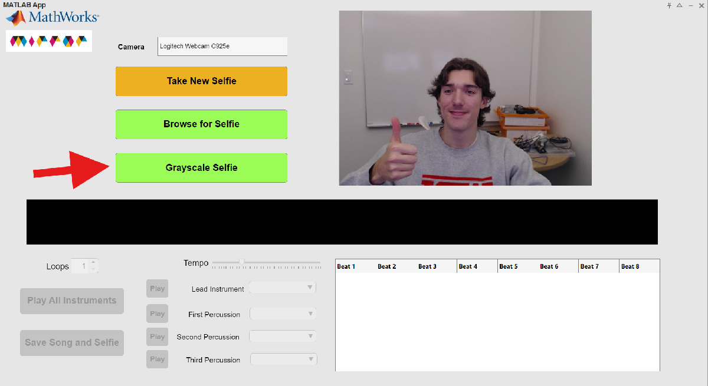

-  This should bring up a pop\-up window with your selfie in black and white, and the following instructions: 

 *'Select 8 points on your selfie with the cursor. Press the "Enter" key to save them.'* 

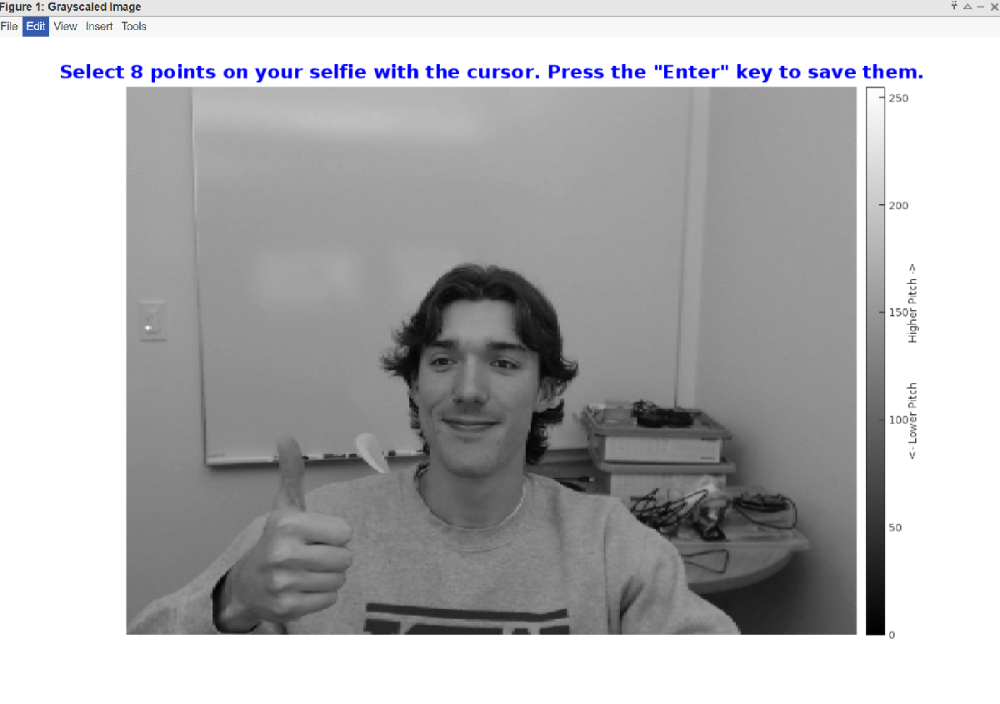

-  The pixels/points you select will determine the notes that are populated in the Sample Table. Darker pixels will result in lower notes, and lighter pixels will result in higher ones. 

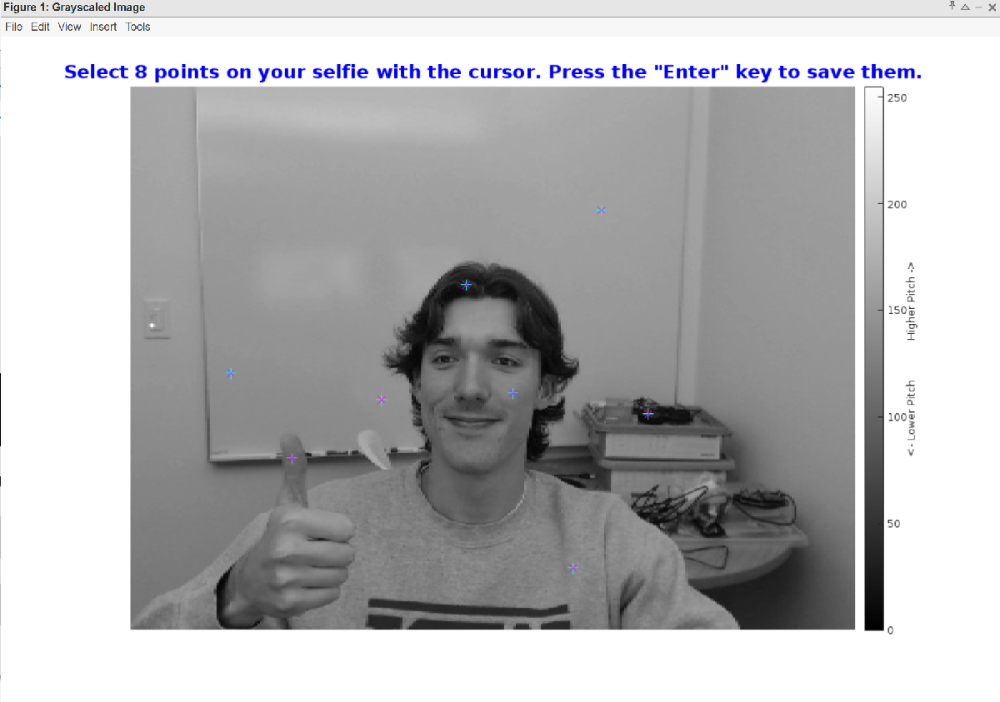

-  Use your cursor to select 8 points on your selfie, then press the "Enter" key on your keyboard to close the pop\-up window. 
-  You should now see your grayscale selfie in the preview window, with the pixels you selected labeled. Also, your Sample Table should now be populated with notes that correspond to the pixels you selected. 

### Choosing Lead and Percussion Instruments
-  Now that you have your musical notes, it's time to choose your lead and percussion instruments. 
-  Use the dropdown menus on the left to select between different lead instruments and percussion instruments. The app allows for one lead instrument and 3 percussion instruments at one time. 

*Note: If you see the notes changing when you select a new Lead Instrument, this is because of the transposition that is necessary between instruments. For example, a tuba cannot play as high of notes as a trumpet, so the notes are adjusted lower to compensate.*

### Editing Percussion Beats
-  Now you've selected your instruments, but may want to edit what beats they will play on. By default, the percussion instruments will play on beats 1, 3, 5, and 7.  

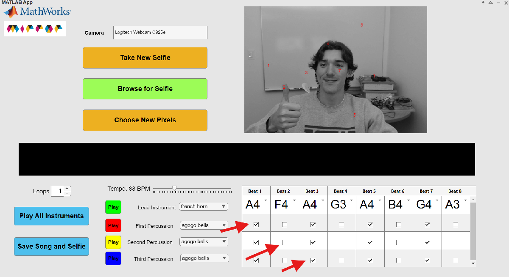

-  To customize which instrument plays which beats, just check/uncheck the beat for that particular percussion instrument in the Sample Table. 

### Manually Adding Custom Notes or Rests
-  What if you want a specific note, like G4, to be played on a specific beat by your lead instrument? 
-  If you want to select a custom note without selecting new pixels, you can click right in the Sample Table cell you want to edit, and a dropdown of note options will appear for you to select from.  
-  You will also see "&" as a note option, which corresponds to a "rest" instead of playing a note! 

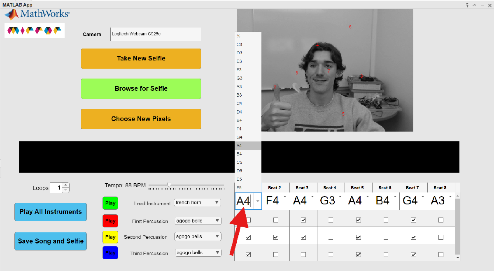

### Playing your Sample
-  You're ready to hear your sample! 
-  Press the "Play all Instruments" button to hear your full sample. 

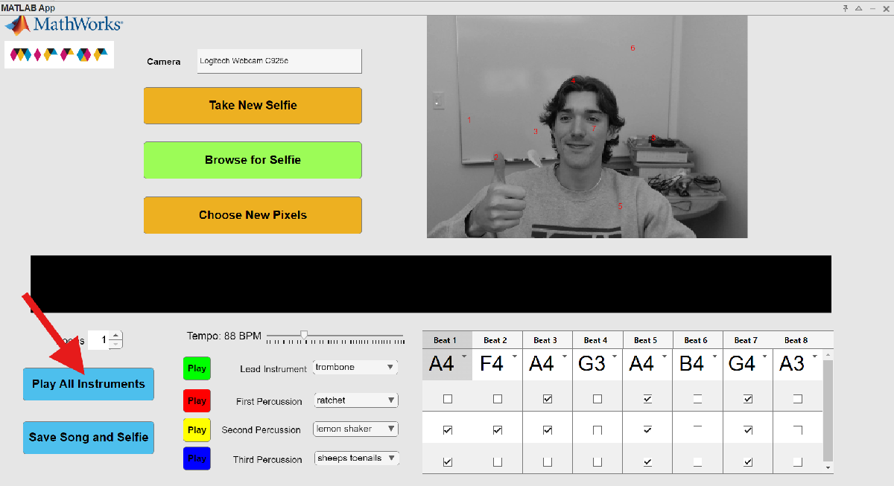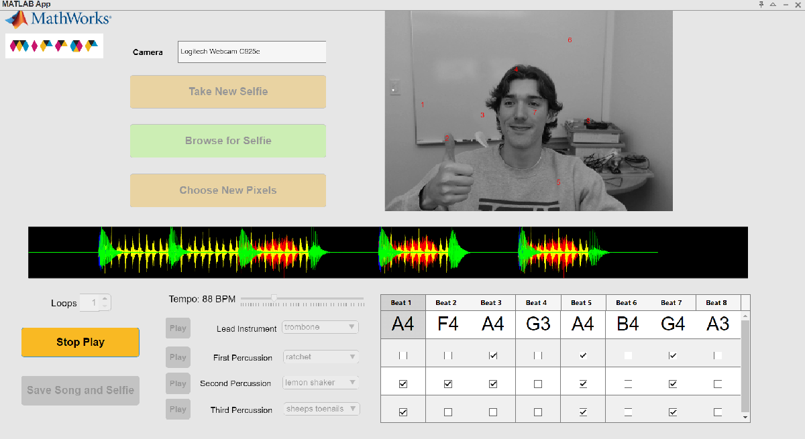

-  Want to hear your individual lead instrument or a percussion instrument? Use the "Play" button next to the instrument name to hear just that instrument. 

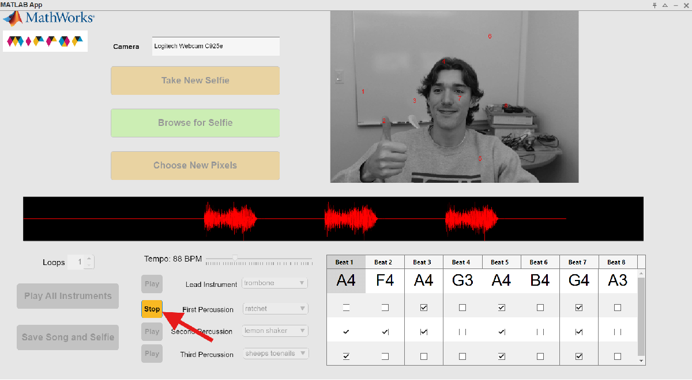

-  Loop your sample using the "Loops" spinner and control how many times the 8 beats will repeat on playback. 
-  Adjust the tempo of your sample using the "Tempo" slider. 

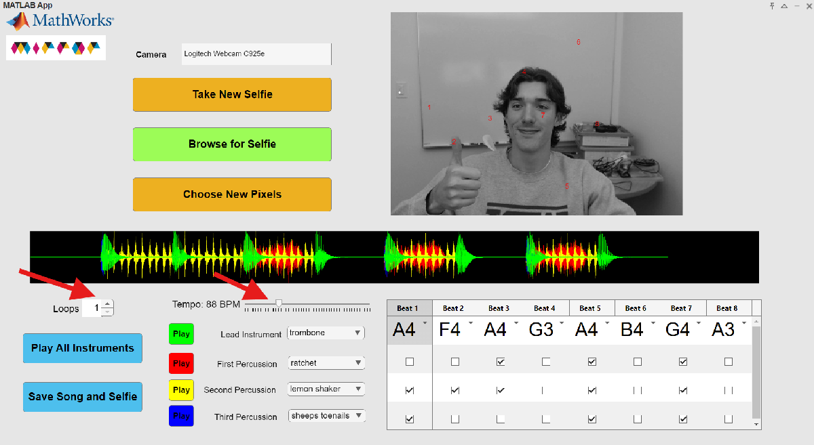

-  Want to change the instruments or beats they are playing on? You can edit these at any time and tweak your Selfie Sample to your liking. 
### Saving your Selfie and Sample
-  You're ready to share your sample with others! 
-  Press the "Save Song and Selfie" button to save the selfie you took, as well as the sample you created. 
-  You will be prompted to select a location within your MATLAB Drive for the files. 

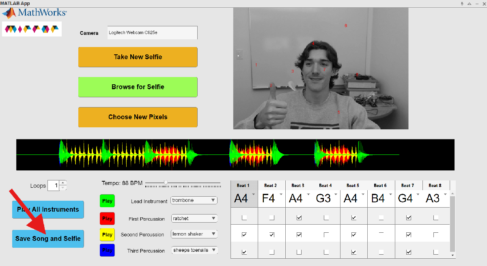

## Products

MATLAB®, [App Designer](https://www.mathworks.com/help/matlab/app-designer.html)

# License

The license for this module is available in the [LICENSE.md](https://github.com/MathWorks-Teaching-Resources/REPO_NAME/blob/release/LICENSE.md).

Music Clips are provided by The Philharmonia Orchestra. The license information can be found at [https://philharmonia.co.uk/resources/sound\-samples/](https://philharmonia.co.uk/resources/sound-samples/)

# Educator Resources
-  [Educator Page](https://www.mathworks.com/academia/educators.html) 

# Contribute 

Looking for more? Find an issue? Have a suggestion? Please contact the the [MathWorks STEM Outreach team](mailto:stemoutreach@groups.mathworks.com).

 *©* Copyright 2024 The MathWorks™, Inc

